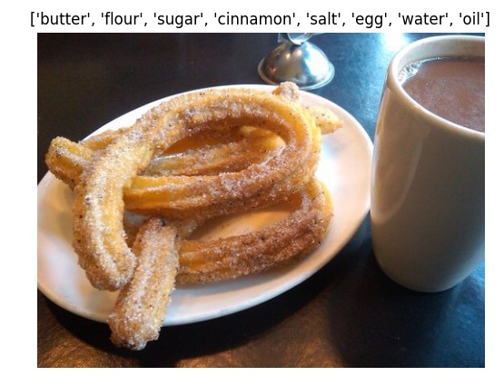
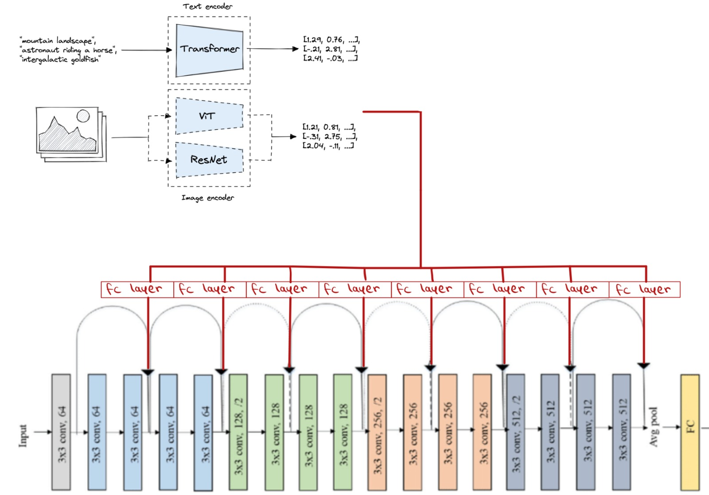

<h1 style="text-align: center;">
CLIPyourFood
</h1>

<h3 style="text-align: center;">
<a href="https://www.linkedin.com/in/betty-khaimov-027b4016a/">Elizabet Khaimov</a> & 
<a href="https://www.linkedin.com/in/ori-zehngut-633344213/">Ori Zehngut</a>
</h3>

<p style="text-align: center;">
Project in Deep Learning course - 046211, Technion, 2022-2023 
</p>

Used repository in this project OpenAI-CLIP
[GitHub](https://github.com/openai/CLIP) <br />
Helping repositories along the way: [Classifier-GitHub](https://github.com/mandeer/Classifier), 
[food-101-GitHub](https://github.com/shubhajitml/food-101/blob/master/food-101-pytorch.ipynb)


<p class="aligncenter">
    
</p>


### Sections:
* [Project goal](#project-goal)
* [Dataset](#dataset)
* [Model](#model)
* [Installation Guide](#installation-guide)
* [Train & Test](#train--test)
* [Files in repo](#files-in-the-repository)
------------------------
## Project Goal

Our goal is to recognize from an image of a dish, the ingredients that it consists of, or at least the significant ingredients that can be inferred from the image.
The ability to accurately recognize ingredients in food images has the potential to revolutionize the food industry, from recipe suggestion to dietary management. 
With the increasing popularity of food-related social media platforms and the growing number of people with dietary restrictions, there is a clear need for a tool that can quickly and easily identify ingredients in food images. This project aims to develop a prototype for a model for food ingredient recognition from a given image, with the goal of providing a valuable resource for individuals and companies in the food industry.

------------------------
## Dataset 

[FOOD 101](https://pytorch.org/vision/stable/generated/torchvision.datasets.Food101.html#:~:text=The%20Food%2D101%20is%20a,contain%20some%20amount%20of%20noise.) <br />
commonly used for research in food recognition and classification.
* 101 Food Classes <br />
* 101,000 images <br />
* 800-1300 images in each class <br />

------------------------
## Model 

Our model is based on ResNet18 CNN and CLIP Image encoder.  
The CLIP Image features pass through FC layer, Batch Normalization layer, and are summed to the skip connections of the ResNet activations.

<p class="aligncenter">
    
</p>

------------------------
## Installation Guide
### Prerequisites
| Library                | Version |
|------------------------|---------|
| `Python`               | `3.9`   |
| `cuda (for GPU usage)` | `11.3 ` |
### 1. Virtual Environment
#### 1.1. Create a virtual environment
```bash
python3 -m venv venv
```
#### 1.2. Activate the virtual environment
```bash
source venv/bin/activate
```
#### 1.3. Install the requirements
Install requirements and GUI for display result on sample.
```bash
pip install -r requirements.txt
sudo apt-get install python3-tk
```
### 2. Download the dataset
The used dataset is [FOOD101](https://pytorch.org/vision/stable/generated/torchvision.datasets.Food101.html#:~:text=The%20Food%2D101%20is%20a,contain%20some%20amount%20of%20noise.).<br />
Run the Data/utils.py file as main for downloading the dataset.
* You can clean the data [annotations](http://www.ub.edu/cvub/ingredients101/) by yourself with Data/annotation_extractor.py.

------------------------
##  Train & Test
#### Train model
Modify hyperparameters in the relevant block at `train_model.py`. <br />
The output path should exist. 
Run the train_model script for training model. <br />
You can add to the model CLIP features of image. <br />
If you have dish name info it can be also injected to the model with text encoder of CLIP.<br />
#### Test model on test set
Modify the parameters at `test_model.py` as model path and set the configuration 
for testing the model on test set of FOOD101.<br />
The scores are printed to the output channel (default terminal).
#### Test model on single sample
Modify the parameters section in `sample_test.py`. <br />
The parameters relate to the loaded model and the image path. <br />
The result will be displayed on separate window with the ingredients as the title.

------------------------
## Files in the repository

| File name                                                     | Purpsoe                                                                                                                                       |
|---------------------------------------------------------------|-----------------------------------------------------------------------------------------------------------------------------------------------|
| `train_model.py`                                              | train Resnet18 model with configuration from CLIP.                                                                                            |
| `test_model.py`                                               | load trained model and test on dataset described with json annotation file (default test set of FOOD101).                                     |
| `sample_test.py`                                              | load trained model and test on single image and display with ingredients.                                                                     |
| `Data/IngredientsLoader.py`                                   | modified data loader for parsing the annotation file and the relevant images.                                                                 |
| `Data/utils.py`                                               | utility functions.                                                                                                                            |
| `Data/annotation_extractor.py`                                | scripts for extracting ingredients and dictionary from annotations [ingredients101](http://www.ub.edu/cvub/ingredients101/).                  |
| `Data/Ingredients_json/...`                                   | extracted json files that contain image with it ingredients.                                                                                  |
| `model/BasicNodule.py`                                        | basic script for Resnet implementation from [Classifier](https://github.com/mandeer/Classifier).                                              |
| `model/Resnet.py`                                             | modified Resnet with our additions (image and text extracturs of CLIP). source code from [Classifier](https://github.com/mandeer/Classifier). |
| `model/Resnet_w_concat_connection.py`                         | modified Resnet with different connection in skip connections.source code from [Classifier](https://github.com/mandeer/Classifier).                                                                           |
| `model/utils.py`                                              | utility functions                                                                                                                             |


